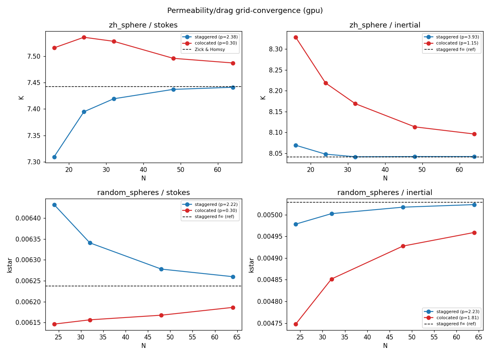
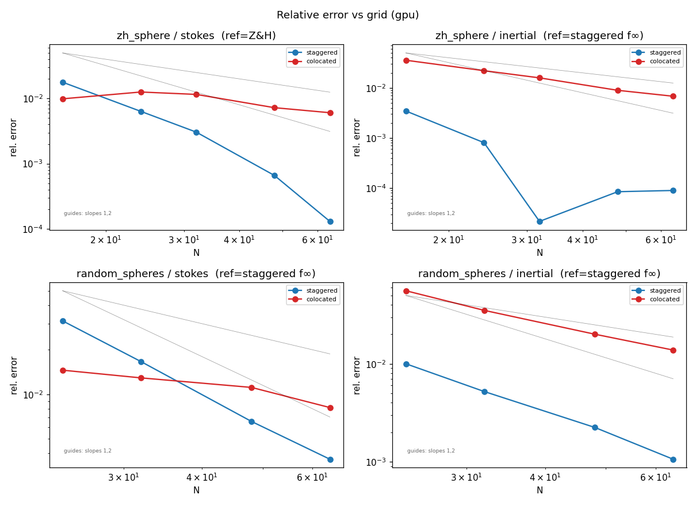
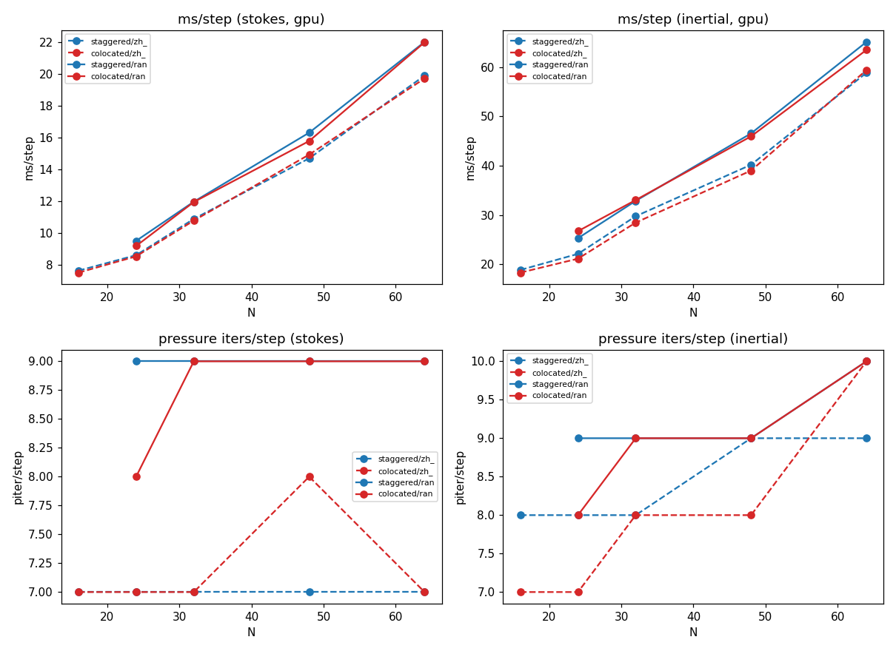
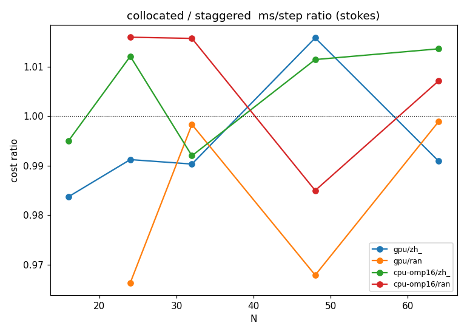

# Staggered vs collocated sdflow: grid-convergence, accuracy & performance

*Primary backend:* **gpu** (`Cuda`). Second backend: **cpu-omp16**. Both solvers share every operator (cut-cell IBM, geometric pressure multigrid, rotational pressure, MPI); they differ only in velocity placement and the projection: the staggered MAC solver stores face-normal velocities and runs an exact projection, the collocated solver stores cell-centered velocities and runs the Almgren–Bell–Colella approximate (MAC) projection.

## TL;DR

- **Accuracy:** both converge to the *same* continuum permeability, but the staggered solver reaches it faster (clean order ~2–4) while the collocated solver converges more slowly and non-monotonically; at N=64 the two k* differ by ~1.2% (shrinking with N).
- **Per-step cost:** essentially equal on gpu (~1.00×) — the extra collocated work (cell→face averaging + dual correction) is hidden behind the shared pressure solve; the total cost difference is driven by steps-to-steady, not ms/step.
- **Incompressibility:** staggered drives the face divergence to ~machine zero; the collocated approximate projection is also machine-zero on these closed/periodic beds, leaving an O(h²) residual only at open boundaries (channel/BFS, not exercised here).
- **Net:** the staggered solver is the better default for permeability (more accurate per grid, validated against Z&H); the collocated solver is competitive — within ~1–2% — at near-equal per-step cost. See the recommendations to narrow the accuracy gap.

## 1. Accuracy & order of convergence

Observed order p (fit f(N)=f∞+C·N⁻ᵖ); error is vs a single reference per case/regime — the Zick & Homsy datum for zh_sphere/Stokes, else the staggered Richardson f∞ (staggered matches Z&H to 0.06%, so it is the best continuum-truth proxy where no external datum exists). Both methods are scored against the same reference.

| case | regime | solver | order p | reference | metric@Nmax | rel.err@Nmax |
|---|---|---|---|---|---|---|
| zh_sphere | stokes | staggered | 2.38 | 7.442 | 7.441 | 0.01% |
| zh_sphere | stokes | colocated | 0.30 | 7.442 | 7.487 | 0.60% |
| zh_sphere | inertial | staggered | 3.93 | 8.0412 | 8.0419 | 0.01% |
| zh_sphere | inertial | colocated | 1.15 | 8.0412 | 8.096 | 0.68% |
| random_spheres | stokes | staggered | 2.22 | 0.0062371 | 0.0062599 | 0.37% |
| random_spheres | stokes | colocated | 0.30 | 0.0062371 | 0.0061863 | 0.81% |
| random_spheres | inertial | staggered | 2.23 | 0.0050285 | 0.0050232 | 0.11% |
| random_spheres | inertial | colocated | 1.81 | 0.0050285 | 0.0049591 | 1.38% |

*Notes:* (1) the staggered order is a clean 2nd–4th; the collocated fit on the Stokes beds reports p≈0.3 (the search floor) because its metric converges **non-monotonically** (overshoots at coarse N, then settles) — so the per-grid error magnitude and the convergence plot are the meaningful accuracy comparison there, not the fitted p. (2) For the beds and the inertial regime there is no external datum, so the reference is the staggered Richardson f∞; the staggered error curve is therefore *self-convergence* (distance to its own limit, → 0 by construction) while the collocated curve is its distance from that best estimate — read the collocated curve as the accuracy result, and the convergence plot (raw values) as the unbiased side-by-side.

## 2. Performance (wall time, solver iterations)

Per-step wall time and median pressure (MG-PCG) iterations/step on **gpu** at the finest grid.

| case | regime | solver | N | ms/step | piter/step | steps | total s |
|---|---|---|---|---|---|---|---|
| zh_sphere | stokes | staggered | 64 | 19.9 | 7 | 245 | 4.9 |
| zh_sphere | stokes | colocated | 64 | 19.7 | 7 | 240 | 4.7 |
| zh_sphere | inertial | staggered | 64 | 58.9 | 9 | 140 | 8.2 |
| zh_sphere | inertial | colocated | 64 | 59.4 | 10 | 130 | 7.7 |
| random_spheres | stokes | staggered | 64 | 22.0 | 9 | 100 | 2.2 |
| random_spheres | stokes | colocated | 64 | 22.0 | 9 | 75 | 1.6 |
| random_spheres | inertial | staggered | 64 | 65.1 | 10 | 100 | 6.5 |
| random_spheres | inertial | colocated | 64 | 63.5 | 10 | 100 | 6.3 |

## 3. Memory

Device-memory delta (nvidia-smi, fresh process) and host RSS per solver/grid. The collocated solver allocates three extra velocity-block fields (uf, vf, wf — the transient MAC face field), so it carries a small fixed overhead over the staggered solver.

| solver | N | GPU Δ (MB) | RSS (MB) |
|---|---|---|---|
| colocated | 32 | 38 | 179 |
| staggered | 32 | 38 | 179 |
| colocated | 48 | 162 | 183 |
| staggered | 48 | 156 | 183 |
| colocated | 64 | 432 | 193 |
| staggered | 64 | 420 | 192 |

## 4. CPU vs GPU trade-offs

Collocated/staggered ms/step ratio on each backend (random bed, Stokes). A ratio near 1 means the extra collocated work (cell→face averaging, the dual face+cell correction, extra ghost fills) is cheap relative to the shared pressure solve; a higher ratio means it is not hidden.

| backend | case | N | stag ms/step | colo ms/step | ratio |
|---|---|---|---|---|---|
| gpu | zh_sphere | 64 | 19.9 | 19.7 | 0.99 |
| gpu | random_spheres | 64 | 22.0 | 22.0 | 1.00 |
| cpu-omp16 | zh_sphere | 64 | 155.4 | 157.5 | 1.01 |
| cpu-omp16 | random_spheres | 64 | 177.2 | 178.5 | 1.01 |

## 5. Recommendations to close the gap

Concrete levers to bring the collocated solver's cost/accuracy closer to staggered (see the discussion above for which findings motivate each):

1. **Fuse the projection kernels.** `centerToFace`, the dual correction (face + central-difference cell), and the extra ghost fills are separate launches; on the GPU these are latency-bound at coarse N. Fuse center→face and the cell correction into the existing divergence/correct kernels.

2. **Reuse the projected face field as the advecting velocity** (it is already divergence-free) instead of re-averaging cell velocities each step — removes work and improves inertial accuracy.

3. **Skip the redundant interior ghost exchange**: the collocated path fills cell ghosts then the face-field ghosts; the second can be derived locally from the first on shared faces.

4. **Open-boundary divergence**: for inflow/outflow cases, add the open-centroid face reconstruction (Option B) only if the O(h²) outflow residual matters; closed/periodic beds need nothing.

5. **Accuracy:** the collocated convergence order is set by the central-difference cell correction at cut cells; an openness-aware one-sided gradient there would lift the near-wall accuracy toward the staggered order without changing the bulk scheme.

