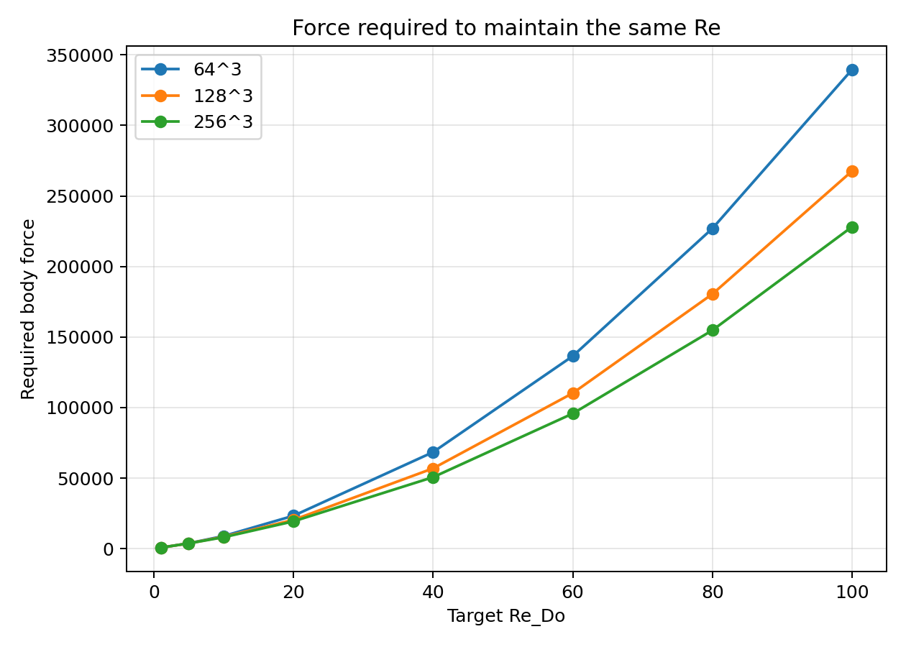
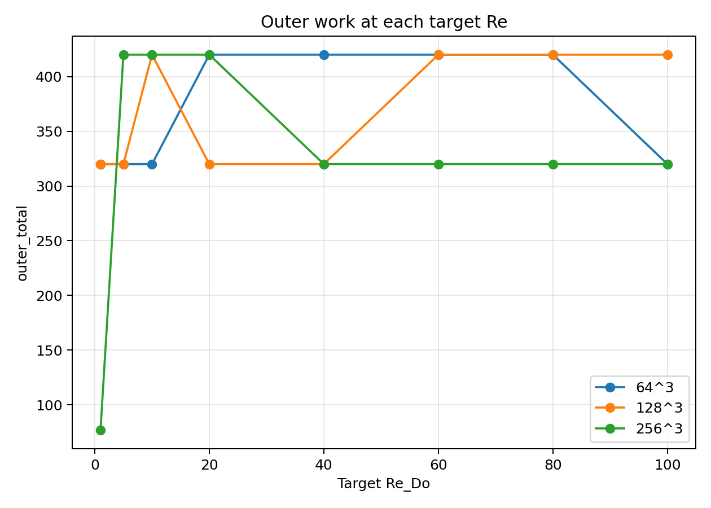
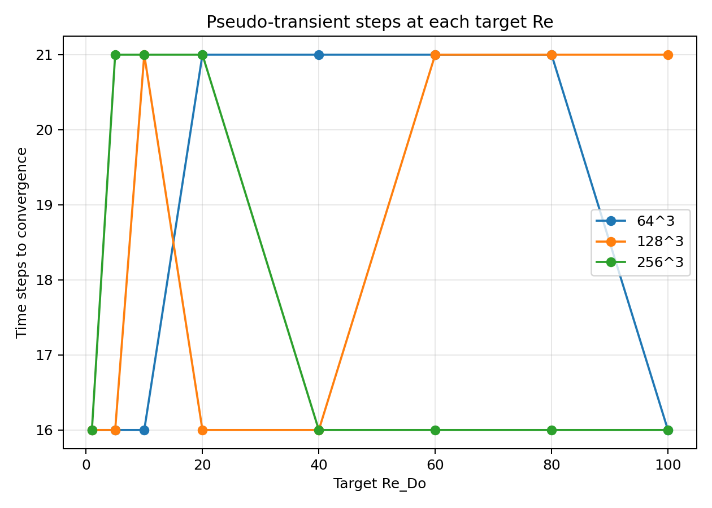
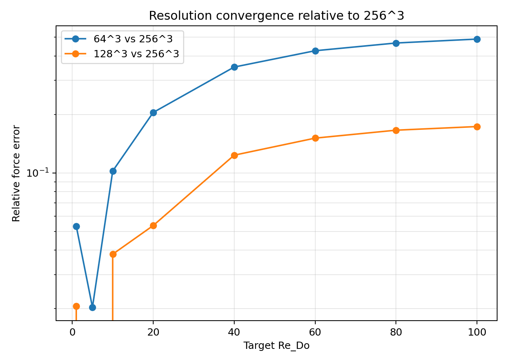
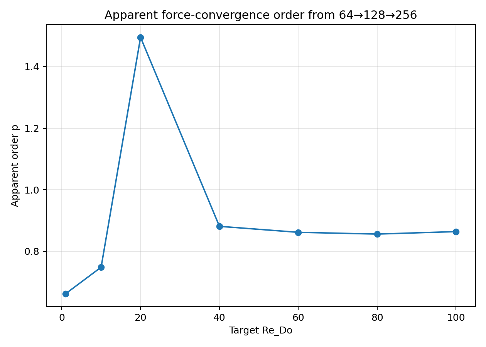

# Packed-bed multi-resolution target-Re study

This study used the stabilized mixed advection scheme to solve the same packed-bed case on three grids:

- `64^3` (derived by periodic linear resampling of `data/packing_256.vti`)
- `128^3` (`data/packing_128.vti`)
- `256^3` (`data/packing_256.vti`)

For each target Reynolds number, the workflow was:

1. solve `64^3`,
2. resample the converged state to initialize `128^3`,
3. resample the converged `128^3` state to initialize `256^3`.

The targets were:

`Re_Do = [1, 5, 10, 20, 40, 60, 80, 100]`

Saved states for all 24 solved points are in `output/packing_multires_re_targets/states/`.

## Main findings

- The coarse-to-fine initialization strategy worked cleanly on all targets up to `Re=100`.
- The required body force for a fixed `Re` decreases monotonically with refinement:
  - `force_64 > force_128 > force_256`
- The `128^3` and `256^3` curves are much closer to each other than either is to `64^3`, but the gap still grows with `Re`.
- By `Re=100`, the force error relative to `256^3` is already about:
  - `48.8%` on `64^3`
  - `17.3%` on `128^3`

So `64^3` is useful as a continuation/initialization grid, but not as an accurate quantitative surrogate in the inertial regime.

## Force required to maintain the same Reynolds number

| Target `Re_Do` | Force `64^3` | Force `128^3` | Force `256^3` | `|F64-F256|/F256` | `|F128-F256|/F256` |
| ---: | ---: | ---: | ---: | ---: | ---: |
| 1 | 659.76 | 682.50 | 696.87 | 5.32% | 2.06% |
| 5 | 3785.75 | 3710.26 | 3710.26 | 2.03% | 0.00% |
| 10 | 8907.43 | 8389.45 | 8081.04 | 10.23% | 3.82% |
| 20 | 23278.93 | 20359.82 | 19324.49 | 20.46% | 5.36% |
| 40 | 68388.13 | 56883.71 | 50636.80 | 35.06% | 12.34% |
| 60 | 136446.51 | 110182.51 | 95727.42 | 42.54% | 15.10% |
| 80 | 226897.53 | 180429.12 | 154752.51 | 46.62% | 16.59% |
| 100 | 339500.11 | 267597.84 | 228088.97 | 48.85% | 17.32% |

## Graphs

### Force vs target Reynolds number

The force-Re branch shifts downward with refinement. The difference between `128^3` and `256^3` remains clearly visible through `Re=100`.

### Outer work vs target Reynolds number

The fine-grid solves remain tractable when seeded from the next coarser converged state.

### Time steps vs target Reynolds number

The coarse-to-fine initialization reduces the amount of transient settling needed on the finer grids.

### Relative force error versus `256^3`

The `64^3` error grows quickly with `Re`, while `128^3` remains much closer but is not yet asymptotically converged at the top of the range.

### Apparent force-convergence order

Using

$$
p \approx \log_2\left(\frac{F_{64} - F_{128}}{F_{128} - F_{256}}\right),
$$

the apparent order is mostly around `p ≈ 0.85-0.9` over the moderate/high-Re range, with some variation at low Re where the three curves are still very close.

## Interpretation

- The current multilevel workflow is effective:
  - use `64^3` to cheaply trace the branch,
  - use interpolated `64^3` states to initialize `128^3`,
  - use interpolated `128^3` states to initialize `256^3`.
- For **accuracy**, `64^3` is not sufficient beyond low Re.
- For **production-quality force/Re data**, `256^3` is preferable, while `128^3` is a useful intermediate predictor and initializer.
- At `Re=100`, the remaining `128^3 -> 256^3` shift is still significant, so the solution is **not yet grid-converged by `128^3`** in that inertial regime.

## Outputs

- Summary CSV: `output/packing_multires_re_targets/multires_re_targets_summary.csv`
- Attempt-level CSV: `output/packing_multires_re_targets/multires_re_targets_attempts.csv`
- Saved states: `output/packing_multires_re_targets/states/`
- Plots:
  - `output/packing_multires_re_targets/force_vs_re_by_resolution.png`
  - `output/packing_multires_re_targets/outer_total_vs_re_by_resolution.png`
  - `output/packing_multires_re_targets/steps_vs_re_by_resolution.png`
  - `output/packing_multires_re_targets/force_relative_error_vs_256.png`
  - `output/packing_multires_re_targets/force_order_vs_re.png`
