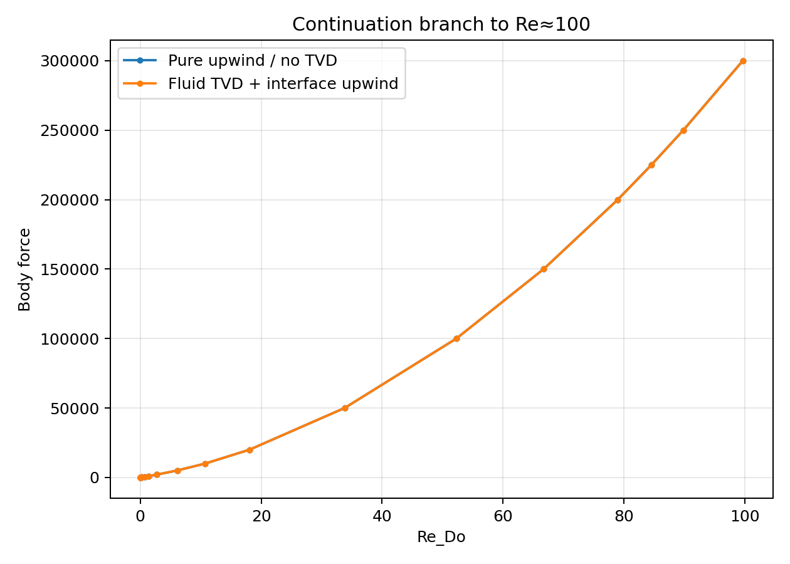
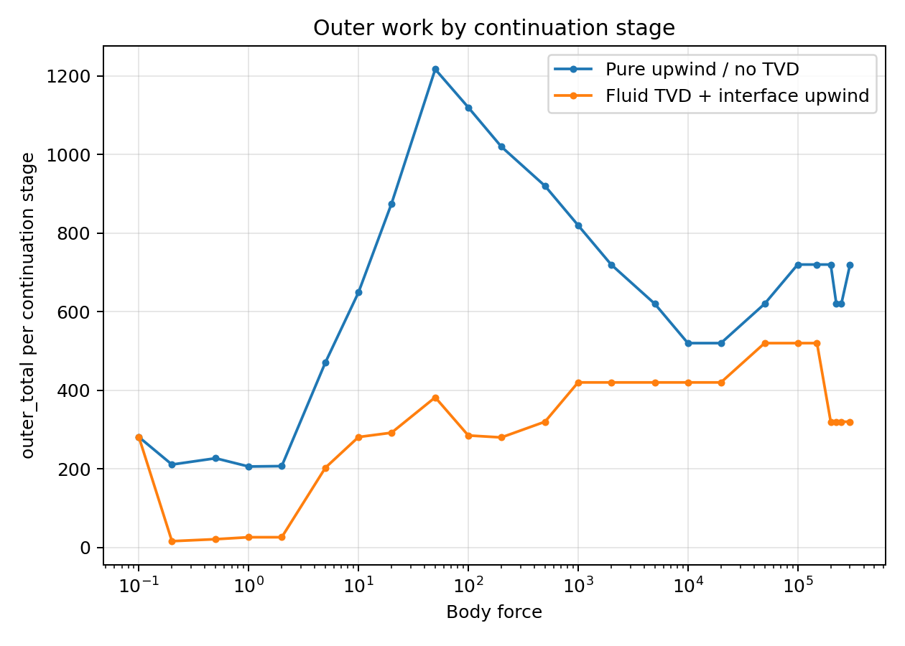
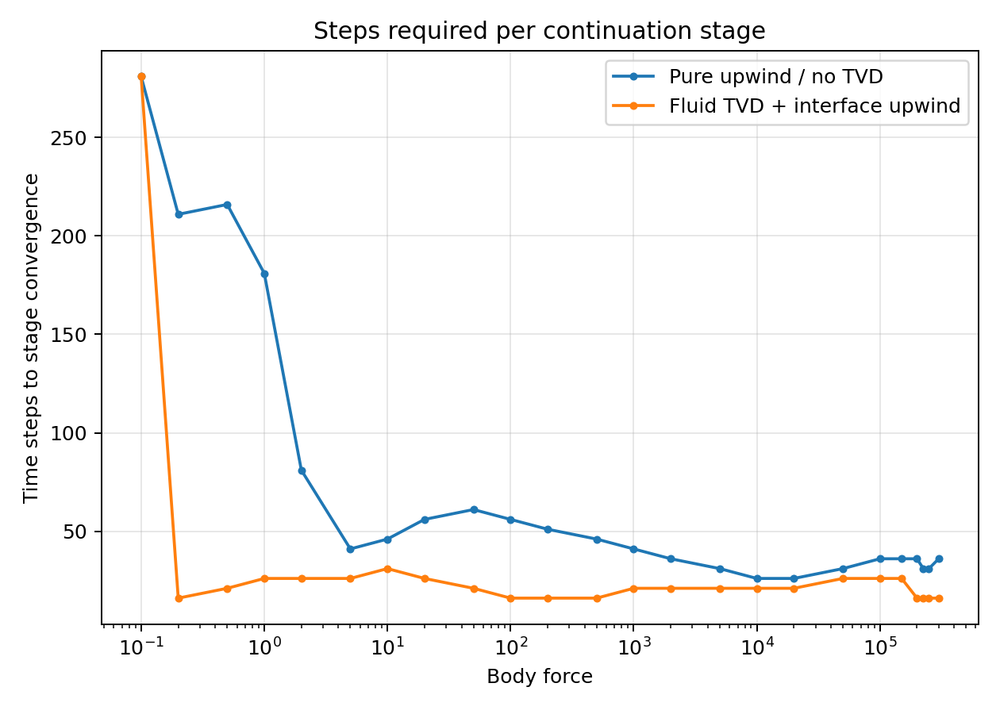
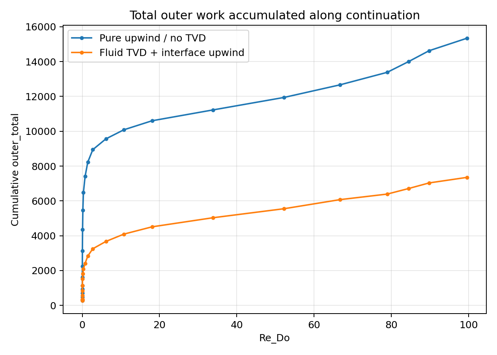

# Re≈100 stability investigation for the packed-bed case

This report summarizes the debugging and stabilization work for the `128^3` packed-bed case (`data/packing_128.vti`) that previously failed during continuation into the inertial regime.

## Main outcome

The unstable path was traced to the **near-interface advection treatment**, not to a missing bulk convection term.

- The bulk fluid kernel already used a consistent **FOU Jacobian + TVD/Koren deferred correction**.
- The problematic behavior came from the **IBM near-interface momentum rows**, where the original central/midpoint treatment could produce a positive off-diagonal convection coefficient in thin seam-adjacent cut cells.
- The most sensitive cell was a seam-adjacent `u`-face near `(4, 20, 108)`, where the combination of very small cut fractions and the central interface treatment created the first strong hotspot.

After the fix below, continuation is stable to about `Re = 100` on the tested force ladder.

## Implemented fix

Two changes were kept in the solver:

1. **Corrected sandwich IBM formulas** in `src/cfd_solver_ibm_kernels.cuh`, following the updated derivation in `doc/Robust_Scaled_IBM_Solver.tex`.
2. **Keep the IBM near-interface advection on FOU/upwind**, while restoring the **TVD deferred correction in the pure-fluid kernel** in `src/cfd_solver.cu`.

This preserves the robust interface rows while still recovering the higher-order deferred correction away from the geometry.

## Continuation setup

Both continuation runs used the same packed-bed setup and the same force ladder:

- geometry: `data/packing_128.vti`
- forces: `0.1 -> 300000`
- timestep rule: `dt = 50 / force`
- pressure multigrid enabled
- velocity smoother iterations: `2`
- outer iteration cap: `20`

The solution from each force level was used to initialize the next level.

## Comparison of the two stable variants

| Scheme | Final force | Final `Re_Do` | Final stage steps | Final stage `outer_total` | Total `outer_total` |
| --- | ---: | ---: | ---: | ---: | ---: |
| Pure upwind / no TVD | 300000 | 99.6336 | 36 | 720 | 15344 |
| Fluid TVD + interface upwind | 300000 | 99.6553 | 16 | 320 | 7353 |

The mixed scheme reaches essentially the same final Reynolds number, but with much lower total outer work than the pure-upwind test configuration.

## Selected continuation points

| Force | `Re_Do` upwind | `Re_Do` mixed | Steps upwind | Steps mixed | `outer_total` upwind | `outer_total` mixed |
| ---: | ---: | ---: | ---: | ---: | ---: | ---: |
| 1000 | 1.4198 | 1.4195 | 41 | 21 | 820 | 420 |
| 20000 | 18.0884 | 18.0881 | 26 | 21 | 520 | 420 |
| 100000 | 52.2834 | 52.2845 | 36 | 26 | 720 | 520 |
| 300000 | 99.6336 | 99.6553 | 36 | 16 | 720 | 320 |

## Graphs

### Continuation branch

The two stabilized variants follow nearly the same force-Reynolds branch up to `Re ≈ 100`.

### Outer work per continuation stage

Restoring TVD in the fluid region while keeping interface rows upwind reduces the outer work substantially relative to the pure-upwind/no-TVD test mode.

### Steps required per continuation stage

At moderate and high forcing, the mixed scheme typically converges each continuation stage in fewer time steps.

### Cumulative outer work along the branch

By the end of the ladder, the mixed scheme accumulates about half the outer work of the pure-upwind/no-TVD run.

## Interpretation

The investigation supports the following picture:

- The **convection term is implemented in the bulk fluid solver** and behaves consistently with the intended FOU-plus-deferred-correction formulation.
- The original instability did **not** look like a simple global CFL limit. It was seeded locally in a **thin IBM cut-cell region near the periodic seam**.
- The corrected sandwich IBM formulas improved robustness, but the decisive stabilization came from **avoiding midpoint/central differencing in the IBM near-interface rows**.
- Reintroducing TVD **only in the pure-fluid region** is clearly stable on the tested ladder and is markedly cheaper than leaving the whole domain on pure upwind.

## Files and outputs

- Report data:
  - `output/re100_upwind_force_continuation.csv`
  - `output/re100_mixed_tvd_scalar_continuation.csv`
- Graphs:
  - `output/re100_force_vs_re_comparison.png`
  - `output/re100_outer_total_comparison.png`
  - `output/re100_steps_comparison.png`
  - `output/re100_cumulative_outer_comparison.png`
- Code:
  - `src/cfd_solver.cu`
  - `src/cfd_solver_ibm_kernels.cuh`
